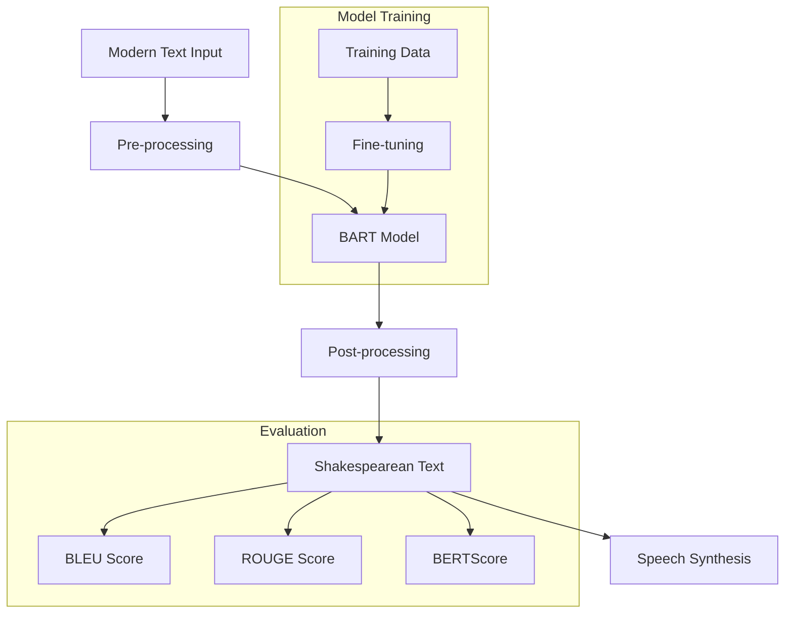

# 🎭 Shakespearify

Transform modern English into Shakespearean style using state-of-the-art language models.


## 🎯 Overview

Shakespearify is an innovative text transformation tool that converts modern English into the eloquent style of Shakespeare. Using fine-tuned T5 models, it captures the essence of Shakespearean language while preserving the original meaning. The project features a Streamlit web app, robust post-processing, and a modular codebase for easy extension.

---

## 🛠️ Tech Stack

- **Frontend/UI**: Streamlit
- **Modeling**: HuggingFace Transformers, PyTorch
- **Data Processing**: Pandas, spaCy, NLTK
- **Speech Synthesis**: gTTS
- **Testing**: pytest, unittest.mock
- **Visualization**: Plotly
- **Development**: Jupyter Notebooks

---

## 🗂️ Project Structure & File Roles

```
shakespearify/
├── data/                # Dataset files (not in git)
├── img/                 # Project images and GIFs
├── notebooks/           # Jupyter notebooks for training and analysis
│   ├── shakespearify.ipynb
│   └── shakespearify-bart.ipynb
├── src/                 # Source code
│   ├── __init__.py
│   ├── app.py           # Streamlit web application (main UI & logic)
│   ├── postprocessing.py # Shakespearean text post-processing utilities
│   └── pages/
│       └── transformers.py # Interactive educational page on transformers & T5
├── tests/               # Test files (pytest)
│   ├── __init__.py
│   └── test_translate.py
├── t5-shakespeare/      # Fine-tuned model files (not in git)
├── t5-shakespeare2/     # Alternative model version (not in git)
├── requirements.txt     # Python dependencies
└── README.md            # Project documentation
```

### File Descriptions
- **src/app.py**: Main Streamlit app. Handles language selection, model loading, translation, and speech synthesis.
- **src/postprocessing.py**: Cleans and enhances model output with phrase and word-level Shakespearean substitutions, using spaCy for POS tagging.
- **src/pages/transformers.py**: Streamlit page explaining transformer models and the T5 architecture interactively.
- **notebooks/**: Contains model training, evaluation, and exploratory analysis.
- **tests/test_translate.py**: Unit tests for translation logic using mocks.
- **t5-shakespeare/**, **t5-shakespeare2/**: Model checkpoints (not tracked in git; see below).

---

## 📊 Workflow & Architecture



---

## 🚀 Features

- Convert modern English, French, or Spanish to Shakespearean English
- Interactive web interface with real-time translation and speech
- Phrase and word-level post-processing for authentic Shakespearean style
- Educational transformer model explorer
- Comprehensive evaluation metrics and test suite

---

## 📈 Model Performance

### Metrics
- **BLEU Score**: 0.1453
- **ROUGE Scores**:
  - ROUGE-1: 0.4644
  - ROUGE-2: 0.2050
  - ROUGE-L: 0.4348
  - ROUGE-Lsum: 0.4347
- **BERTScore F1**: 0.6763

### Sample Translations

1. **Modern**: "Indeed, and I am happy about that."  

   **Shakespeare**: "Marry, And I am glad of it with all my heart:"  

   **Model**: "Forsooth, and I am gleeful of that."

2. **Modern**: "What, by God, may she do? She may marry a king, a bachelor, a handsome young man. Certainly, your grandmother had a worse match."  

   **Shakespeare**: "What, marry, may she? Marry with a king, A bachelor, a handsome stripling too. I wis, your grandam had a worser match."  

   **Model**: "What, By my faith, may she dost? She may marry a Monarch, a bachelor, a handsome youthful gentleman. Certainly, thy grandmother had a worse match."

3. **Modern**: "That sounds good to me."  

   **Shakespeare**: "It likes me well."  

   **Model**: "That sounds well to me."

4. **Modern**: "I came as an ambassador from Edward, but I return as his sworn and deadly enemy. He told me to take care of his marriage, but he'll have war instead."
   
   **Shakespeare**: "I came from Edward as ambassador,  But I return his sworn and mortal foe:  Matter of marriage was the charge he gave me,  But dreadful war shall answer his demand."
   
   **Model**: "I came as an ambassador from Edward,   But I return as his sworn and fatally foe.   He told me to take care of his marriage, but he 'll hast strife."

5. **Modern**: "I'll only irritate you if I stay. Let me go."

   **Shakespeare**: "I chafe you, if I tarry. Let me go."

   **Model**: "I will irritate thou if I stay. Let me hie."

---

## 🧑‍💻 Setup & Usage

### 1. Clone the repository
```bash
git clone https://github.com/MichAdebayo/shakespearify.git
cd shakespearify
```

### 2. Install dependencies
```bash
python3 -m venv .venv
source .venv/bin/activate
pip install -r requirements.txt
```

### 3. Download Model Files
Model checkpoints are not included in the repository due to size. Place your fine-tuned models files in `t5-shakespeare/` and/or `t5-shakespeare2/` as needed.

### 4. Run the Streamlit App
```bash
streamlit run src/app.py
```

---

## 🧪 Testing

Run the test suite with:
```bash
pytest tests/
```

---

## 📚 Educational Tools
- Explore transformer models and the T5 architecture interactively via the "How Transformers Work" page in the app (`src/pages/transformers.py`).

---

## 📄 License

[MIT License](LICENSE)

---

## 🤝 Contributing

Contributions are welcome! Please open an issue or submit a pull request.

---

## 🙏 Acknowledgments
- HuggingFace Transformers
- Streamlit
- spaCy, NLTK, gTTS
- Shakespearean datasets from Kaggle and other open sources

---

## 💡 Contact
For questions or suggestions, please open an issue on GitHub or contact the maintainer.